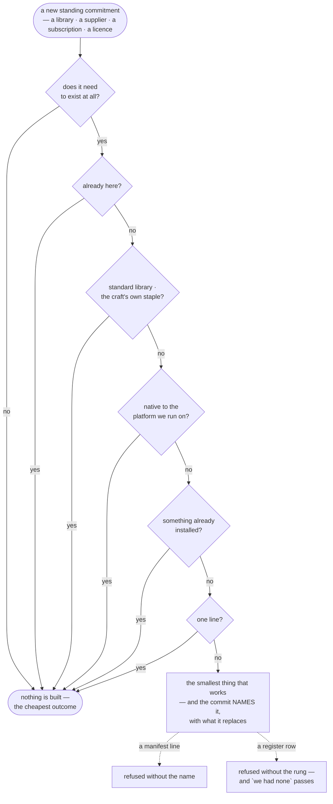

# Choosing tools — the ladder, the ceiling, and the exit

**Load when:** picking a service, a library, a platform or a vendor.

**This is the decision loop with a domain-specific frame** → `SKILL.md`. What is added here is the
ladder that orders the options and the questions that decide between them.

---

## The selection ladder

**free → open source → self-hostable → embeddable in the repo → drivable by an agent**

Work down it, and **a paid option must earn the exception, with the reason recorded**. Not because
paid is bad, but because the default direction of drift is toward whatever was easiest to sign up
for, and a ladder makes drift visible.

**"Drivable by an agent" is not last by accident.** In a project where agents do the work, a tool
only a human can operate makes the owner the bottleneck for every change it touches.

---

## Before the ladder: does this need to exist at all

**The selection ladder answers *which*. It does not ask *whether*** — and the cheapest code is the
code nobody writes. Before choosing between tools, walk down:

**does this need to exist · is it already in the project · does the standard library do it ·
does the platform do it natively · does something already installed do it · can it be one line ·
only then, the smallest thing that works**

**Every rung but the last is a judgement no script can make.** Whether the answer was written
down is not — so the form sits at the one moment it is cheapest to ask: **a commit that adds a
dependency names it in `_ops/DECISIONS.md`, with what it replaces and what was rejected.** Not a
keyword — the dependency's own name, because a gate satisfied by vocabulary teaches people to
sprinkle words. A version bump is not a new dependency and is not asked.

**And this is the decision loop's own last step, made unskippable at one moment.** The loop already
says *frame → search, don't recall → compare, each claim sourced → choose and say why → record in
`_ops/DECISIONS.md` → act* (`SKILL.md`), and every claim inside it carries its rung — **measured ›
cited › recalled › judgement** (`audience.md`). The rung above choosing adds no new obligation; it
picks the **moment** where the existing one is cheapest to meet and hardest to skip. A new standing
commitment is the sharpest instance of *choose and say why*, because it is the decision whose cost
outlives everyone who remembers making it.

**So the form does not ask for research — it asks for the record the loop already owed.** That
distinction matters: a gate demanding *evidence* would be answered with a plausible sentence, and
this corpus knows what plausible sentences are worth. A gate demanding **the name of the thing you
just chose, and what it replaces** cannot be met by anyone who did not make the choice.

**Why a form and not a paragraph.** The ladder is good advice and this corpus measures good advice
at about zero — the same rule as prose moved 1 run in 10 on 2026-08-22, and as a refusal moved 5 in
5. A dependency arrives in a minute and leaves over a year; the person who just chose it is the
only one who can write the line, and they can write it in seconds.

**The two dotted edges are the same rung in two vocabularies**, which is the point: a project with
no package manifest is not exempt. A bakery's dependency is a supplier and its manifest is
`_ops/TOOLING.md`.

**Native-first is the same rung, said earlier** — ask whether the runtime already does it before
designing anything, and record the answer with its date → `tooling.md`.

---

## Free tier first — and name the ceiling

**Not "it has a free tier" but *where the free tier ends*, in the unit that will actually bite**:
requests, seats, rows, builds, minutes, projects — whichever one this project will hit first.

**And what happens at the edge:** does it **throttle**, **hard stop**, or **start charging
automatically**? Those are three completely different risks, and only the third can surprise a
budget.

**Record the ceiling with a check-date** → `tooling.md`. Free tiers move.

---

## No-code and low-code: an exit-cost decision, not a convenience one

**The question is never "is this faster to start" — it always is.** Ask three others:

**Can an agent operate it?** A tool that is only a graphical interface makes the owner the
bottleneck for every change, in a project whose whole point is that agents do the work.

**Can the work leave?** Code in a repository can. A proprietary canvas usually cannot, and *"we
will export it later"* is a sentence people say once.

**What happens at the boundary** — the moment you need something the tool does not do? **A good
answer is "a human owns this surface deliberately, and it is isolated."** A bad one is "we'll
figure it out later", which is how a marketing site becomes the reason you cannot ship a pricing
change.

---

## When something dies, is acquired, or closes its free tier

That is the moment the ladder is actually run, and there are catalogues for exactly this — open
alternatives to a paid default, curated lists per topic. **They are the search step behind the
ladder, not a replacement for the judgement.**

**And the search itself is a method, not a list.** For any domain: `awesome-{topic}`, registries,
the craft's own English terms. **A frozen catalogue ages faster than anything else**, so what is
kept is only the anchors that carry a **licensing or fallback decision** — everything else is
searched at the moment of need.

---

## Licensing is settled before the first line of work

**In every licence-heavy domain the licence decides what you may ship and to whom**, and
discovering it late means rebuilding: plugin formats, font families, sample libraries, stock
footage, recipe rights, model weights.

**Verify per item, not per source.** A permissive library with one differently-licensed component,
or a stock site with one section under other terms, is the normal case rather than the exception.

**Record every shipped asset with its licence** — provenance is portability, and a licence you
cannot prove is one you do not have.

---

## Testing belongs to the loop, not to a stage

Where each kind of check sits is more useful than which tool performs it:

| Loop stage | What runs |
|---|---|
| **build** | unit and component checks — part of the definition of done |
| **review** | the end-to-end suite, accessibility and performance budgets, visual regression against the design system |
| **ship** | a smoke pass against the real thing, plus the launch checklist |
| **measure** | synthetic checks and error reporting, feeding the outcome → `shipping.md` |

**A tool list per platform ages; this mapping does not.** Pick the tools by the same ladder, and
record them with their check-dates.

---

## Security defaults

**Standards, not vibes** — and the classic misses in agent-written code are worth checking every
time because they recur → `security.md`.

**Depth is chosen by risk, not by default.** A landing page gets dependency scanning; anything
holding user data or money earns a real penetration test before it ships.

---

## No per-industry catalogue here, and that is deliberate

**The moment one domain gets its own list, this stops being a method and starts being one
author's project.** What replaces it is the ladder plus a search — `awesome-{topic}` and the
role-builder's tooling step reconstruct a better, fresher list for any vertical than a frozen table
ever could.

**The one transferable rule from every licensing-heavy vertical is the licence one above**, because
it changes the product rather than the toolchain.

---

## Style, when the choice is aesthetic

**The method, not the list.** Name the feeling **in the owner's own words** → collect references →
**extract what actually carries it** (type, spacing, colour, motion) → turn that into tokens.

A frozen list of inspiration links ages faster than anything else, and **what is "clean" to one
owner is "sterile" to another** — the words are theirs, the extraction is yours.
