# Diagrams — the shapes, drawn once

**Load when:** explaining this system to someone, or checking that a flow you are about to
change still matches the picture.

**Every node here names something the corpus defines.** A diagram that introduces a box with no
file behind it is a second source of truth, and the one that ages first — so if a shape below
stops matching its file, the file wins and the diagram is wrong.

---

## The front door

Read from the ground, never asked. Doors exist for every branch below; none of them is how a
route is chosen.

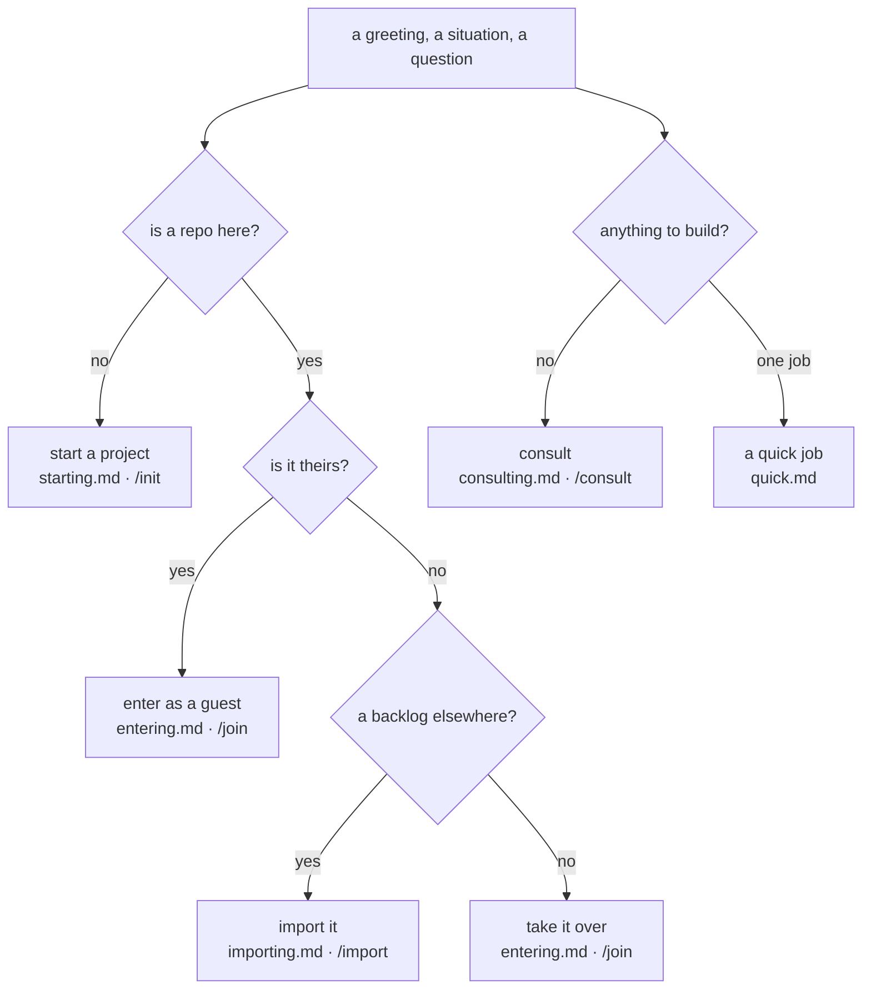

---

## The cascade

One resolution shape for every setting. Each setting declares which rungs it has; the resolved
value is recorded on the run.

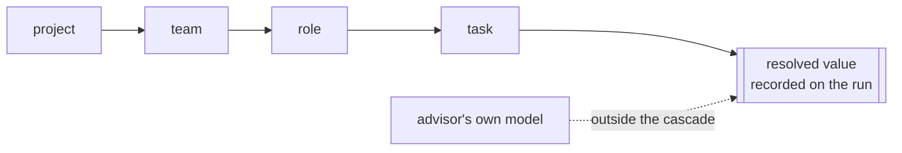

The advisor is the session, so nothing here sets its model — it is read and recorded, never
stored → `hiring.md`.

---

## The six layers, and the cut

One position on a ladder, not six switches. Above the line goes to the repository; below it
stays with you.

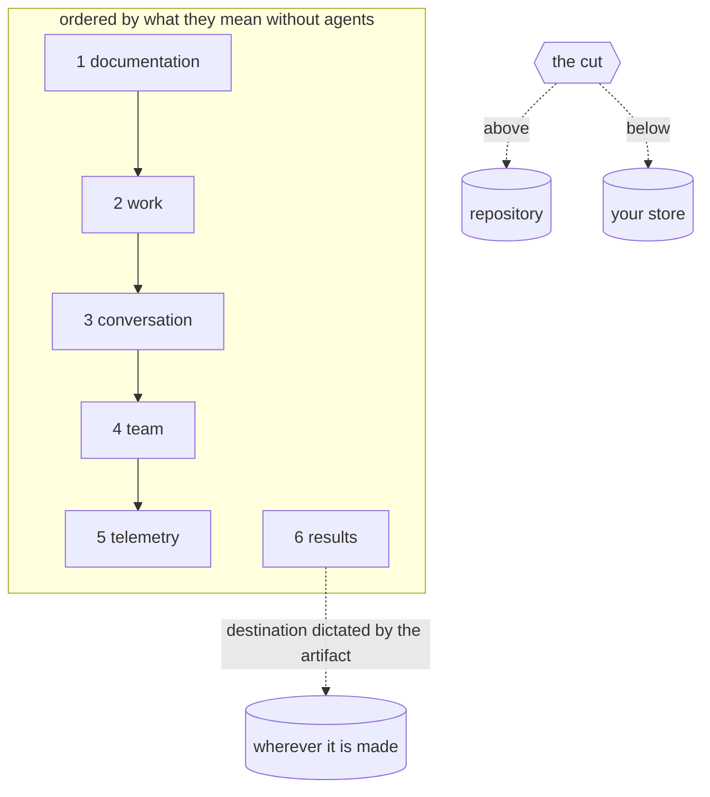

→ `storing.md`

---

## Stage and wave are different things

A stage orders the ladder. A wave orders the children.

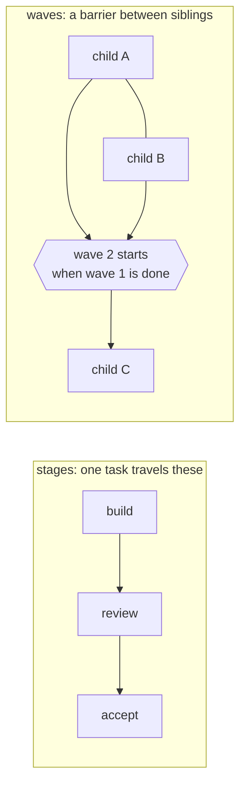

**Nothing transitions itself** — the barrier lifting surfaces the next wave as ready; it does
not start it → `decomposing.md`.

---

## The decision loop

Every real decision runs this, named once so it is followed rather than reinvented.

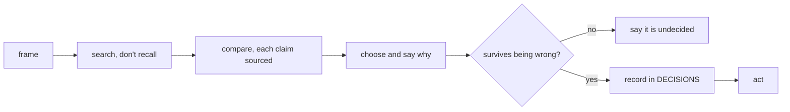

---

## Two evidence pyramids, never pooled

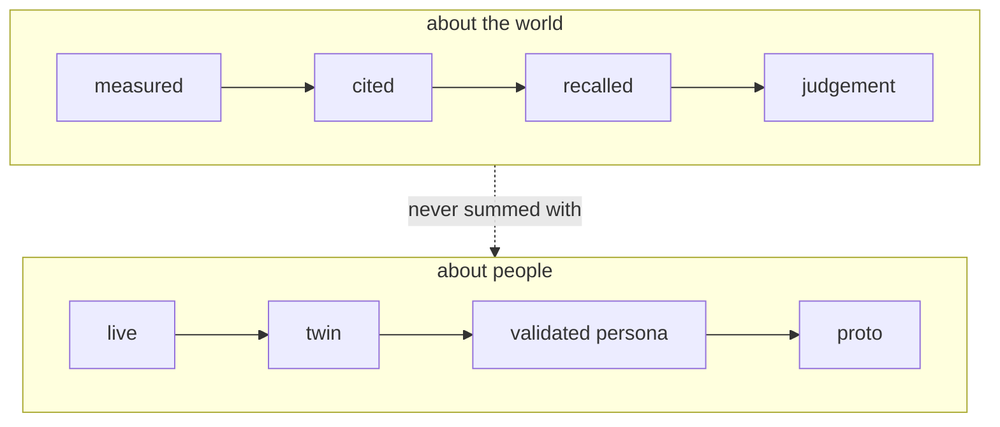

Three live interviews and twenty synthetic runs are never "23 responses" → `audience.md`.

---

## Four kinds route to the owner

The gate belongs to the action rather than the actor, which is why the advisor is not exempt.

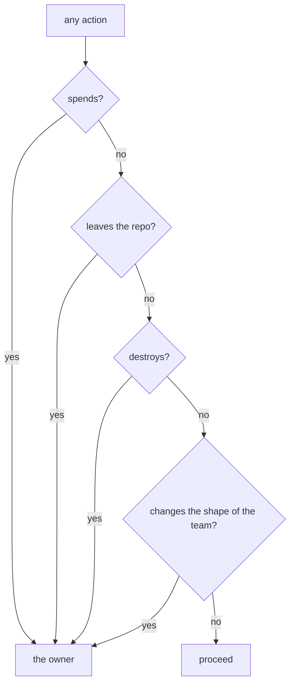

→ `permissions.md`

---

## What actually holds a gate

Only one of these moves between runtimes.

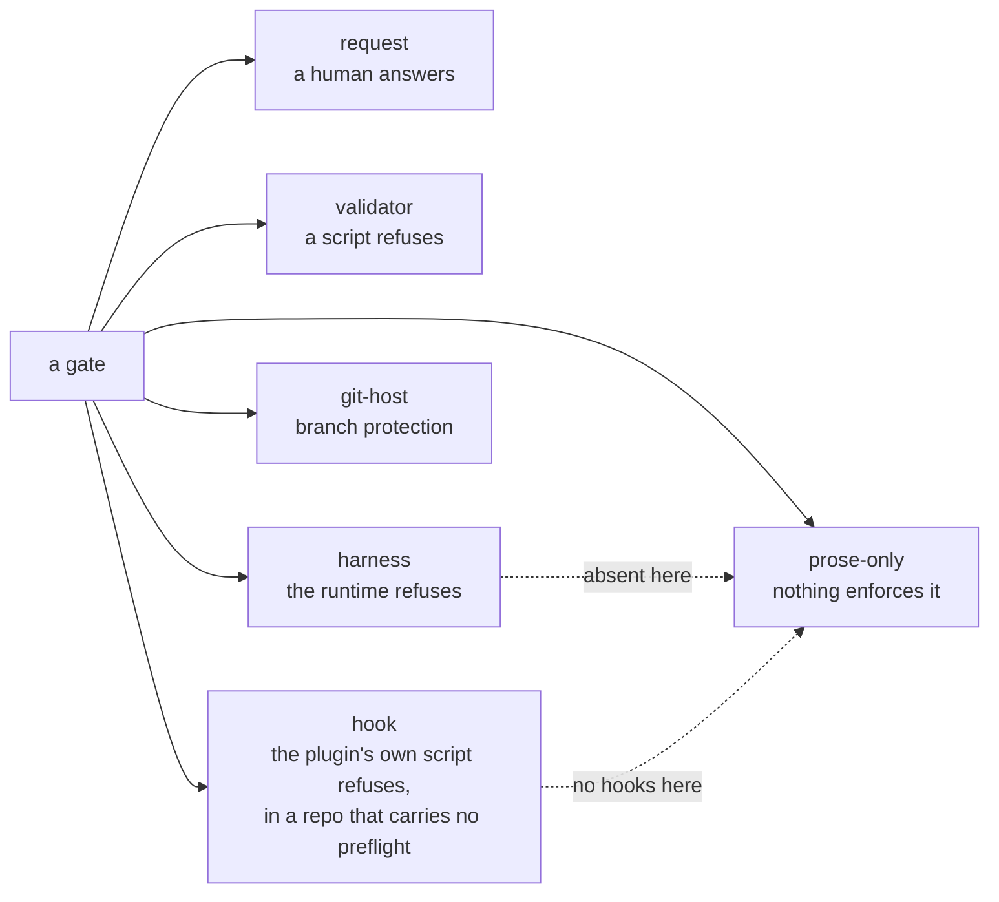

**The downgrade is announced at dispatch, not discovered** → `runtimes.md`.

---

## Recovery reads the repository, not the session

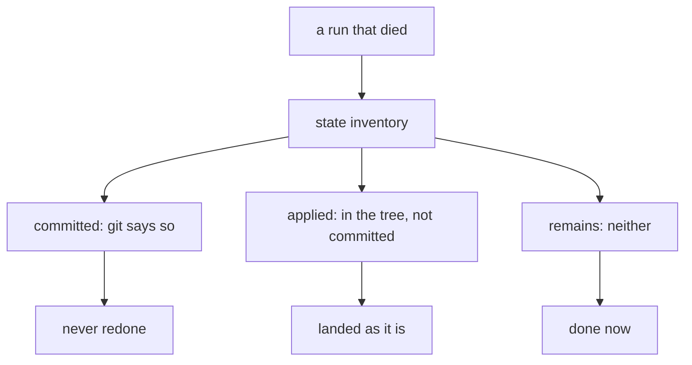

→ `recovering.md`

---

## Three arrangements with an outside tracker

Each names a canonical side. There is deliberately no fourth.

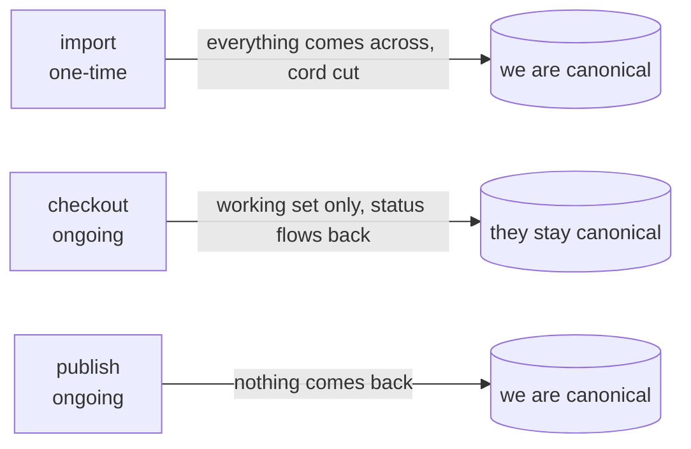

→ `importing.md`

---

## How much of a repository to read

Measuring is nearly free; reading is not. The recommendation is filled in, and all three stay open.

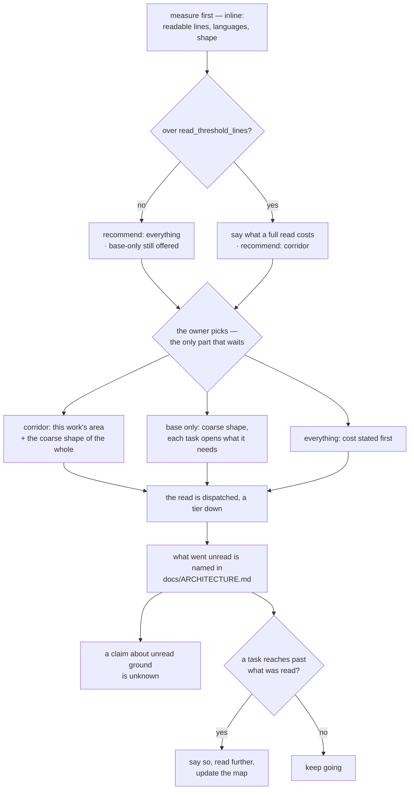

**A guest reads less, not more** → `entering.md`.

---

## The two bars a task passes

Ready to start and ready to finish are different bars, held by different hands. Collapsing them
is how work starts unstartable and finishes undone.

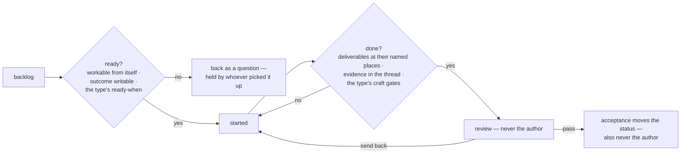

**Done is checked against the list, never against the feeling of doneness** → `writing-work.md`.

---

## The product map, and how a flow climbs into it

Two maps answer two questions; only one of them is about the tree. The map holds what shipped.

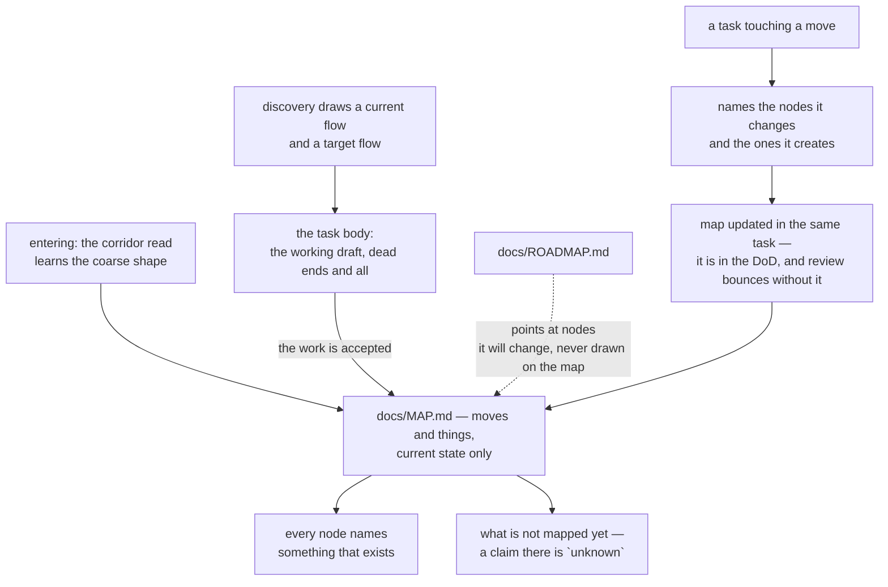

**A map known to be stale is worse than no map: it answers confidently** → `mapping.md`.

---

## Taking a project over, in order

Four steps, and skipping one changes the outcome. The debt list is the deliverable, not the audit.

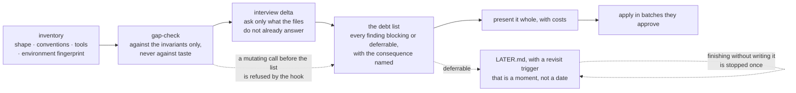

**Nothing is fixed before they have seen the list**, and both ends of that are performed rather
than promised: a mutating call before the list exists is refused, and a run that presented
deferrable findings and wrote no `LATER.md` is stopped once and asked to write them
→ `entering.md`.

---

## An upgrade, in order

Swapping the files is not migrating the project. The log is what tells the two apart.

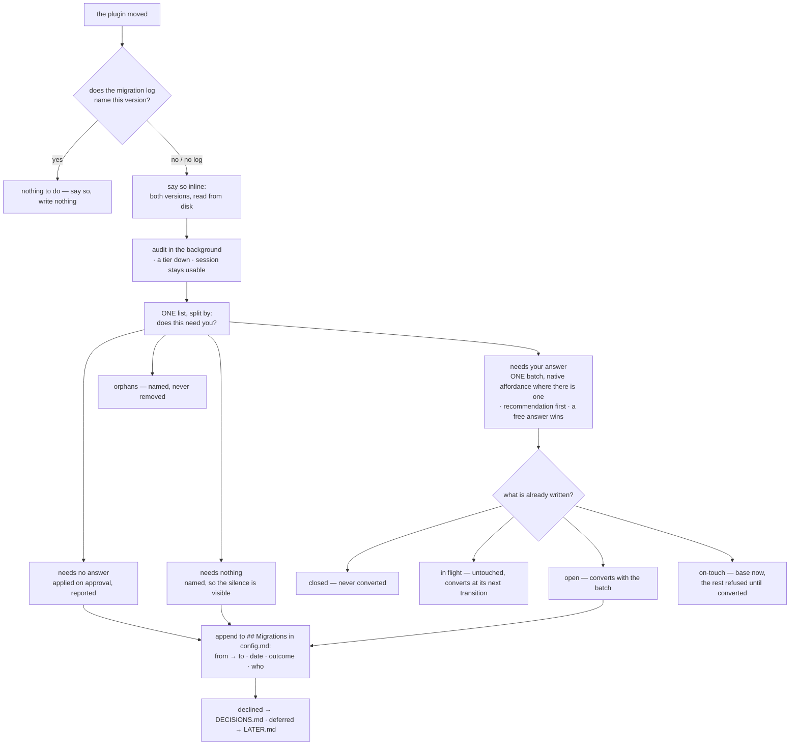

**A guest trips none of this**, and *nothing-required* is a line worth writing → `upgrading.md`.

---

## Guest or successor

Two arrivals wearing the same clothes. Ambiguity is guest.

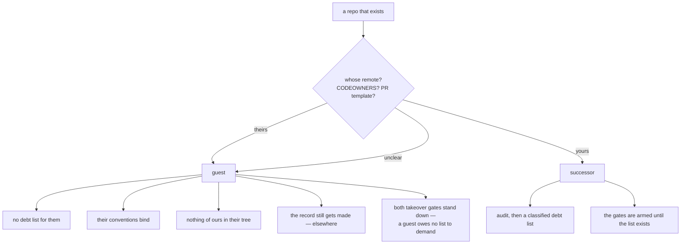

**The same signals the reading uses are the ones the hooks read** — `CODEOWNERS`, a contributor
guide, a PR template, a history in many hands — and on doubt they stand down, because ambiguity
is guest → `entering.md`.

---

## Before a release

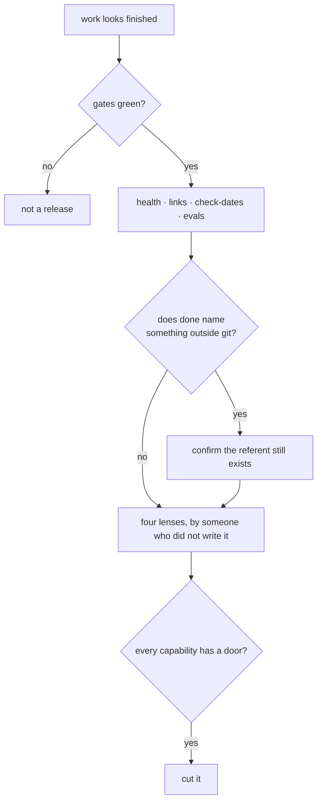

→ `shipping.md`

---

## How a change to this system travels

The same tasks, gates and history as any other work — and one extra rule.

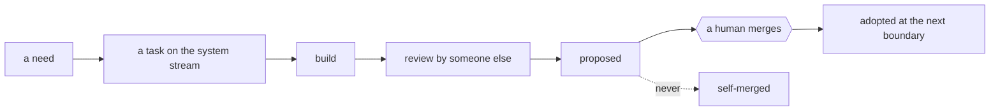

**Self-editing is proposed, never self-merged** → `self-maintenance.md`.

---

## Nobody waits, and nothing runs at the wrong tier

The two halves of the same decision: whether work leaves the turn, and what it runs on.

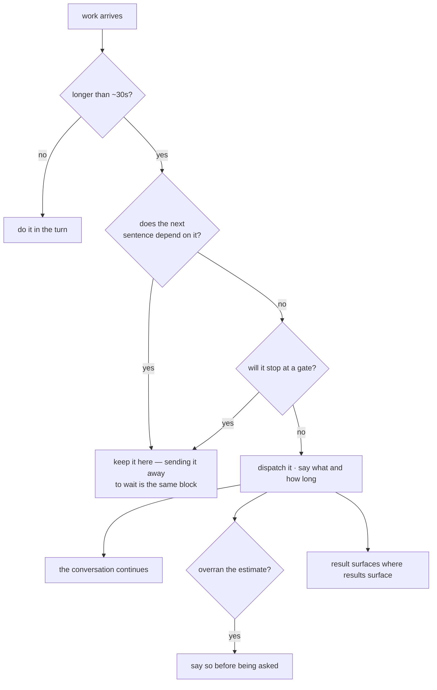

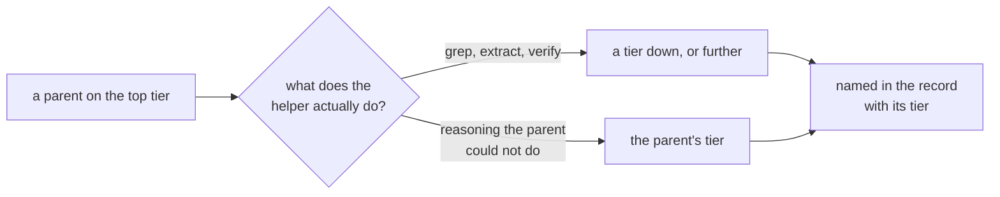

**"Same as me" is the most expensive default available**, and it hides in the bill as ordinary
work → `dispatching.md`.

**The one tier no setting can raise is the advisor's own**, because the advisor *is* the session:

```mermaid
flowchart TD
  T[work about to start] --> WHO{who performs it?}
  WHO -- a dispatched worker --> CASC[the cascade picks its tier]
  WHO -- the advisor, in this turn --> J{judgement-heavy?<br/>a migration or takeover audit,<br/>cutting up a feature, a real decision}
  J -- no --> GO[just do it]
  J -- yes --> SAY[say so BEFORE starting:<br/>if a stronger tier exists here,<br/>this is the moment to switch]
  SAY --> OWNER{the owner switches?}
  OWNER -- yes --> GO
  OWNER -- no --> GO2[proceed anyway — an offer, never a gate<br/>and the output says where it was unsure]
```

**Named as a tier, never as a product** — the runtime may not be the one this was written on.
**A limitation stated before the work is a choice; the same one stated afterwards is an excuse.**

---

## Where a stuck agent goes

```mermaid
flowchart TD
  A[agent, stuck] --> T[tries the obvious first:<br/>retry differently, read what it skipped]
  T --> S{resolved?}
  S -- yes --> ON[carry on]
  S -- no --> E[the expert rung — often skipped,<br/>and it should not be]
  E --> AD[the advisor: routing and aggregation]
  AD --> OWN[the owner]
  A -. spend · outward · destructive ·<br/>shape of team .-> OWN
  AD --> STOP{third attempt<br/>on the same error?}
  STOP -- yes --> HAND[stop, write down what was tried,<br/>hand to a different agent or grade]
```

**Every escalation is a request with an age**, answerable later rather than living in a
conversation → `escalating.md`.

---

## Trust moves both ways, and never by itself

```mermaid
flowchart LR
  R[(a role's run record)] --> UP[runs without a second attempt ·<br/>reviews passing unchanged ·<br/>approved without edits]
  R --> DOWN[attempts climbing ·<br/>the same objection returning ·<br/>done reopened]
  UP --> PROP[proposed to the owner,<br/>with the evidence]
  DOWN --> PROP
  PROP --> OWNER{the owner answers}
  OWNER --> SET[the gate moves]
  FOUR[spend · outward · destructive ·<br/>shape of team] -. no history buys these .-> OWNER
```

**A role never loosens its own gate**, which is `nobody edits the bar they are measured against`
applied where it is most tempting to skip → `permissions.md`.
