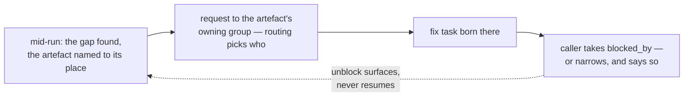
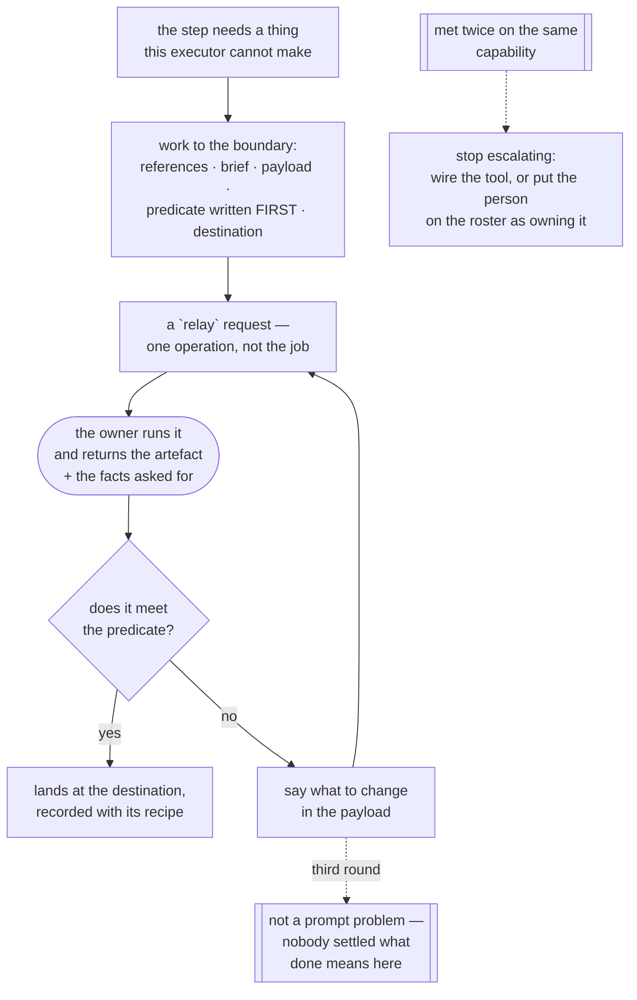

# Escalating — where a stuck agent goes

**Load when:** an agent cannot proceed, an exchange will not converge, or the same failure keeps
repeating.

Not a setting — **a chain, with typed fast lanes**. The other sense of the word, *when work stops
and asks the owner*, is configured and cascades → `permissions.md`.

---

## The chain

**agent → expert (optional) → advisor → owner.**

The agent tries the obvious recovery first — retry differently, read the file it skipped, consult
its own resources — then hands up **with a state inventory**: what it tried, what it observed,
what it needs.

**The expert rung is optional and often skipped, and it should not be.** Experts exist precisely
to be consulted; without this rung the owner gets asked things a hired expert was hired to
answer. Where the project has an expert or a panel covering the domain, the question goes there
before it goes up.

**The advisor is the routing and aggregation owner**, so an unresolved disagreement between two
roles reaches it directly. There is no rung between them, which is a consequence of teams having
no leader — and it makes the path shorter rather than longer.

## Fast lanes — straight to the owner

Because the advisor cannot supply these anyway:

| Class | Why it skips |
|---|---|
| credentials, access, permissions | only the owner can grant them |
| anything destructive | never delegated, in any preset |
| a decision the owner reserved | by definition |
| a limit or quota reset | nothing to do but wait, and whether to wait is the owner's call |

---

## Bounded, not endless

**Three attempts on one task stop it.** Then it is reassigned or escalated — an agent that keeps
trying is spending the budget on the same wall.

The count is **per task, not per "the same error"**. Deciding that two errors are "the same" is a
judgement an agent makes about its own failure — a guess wearing the shape of a fact, and exactly
the bias the output checkpoint warns about. Per task is countable, already recorded as `attempt`,
and therefore `enforced_by: validator` rather than prose.

**A third round on one point is a spec problem, not a quality problem.** This is the most useful
line in the file, because it changes what the escalation *asks for*: not *"who is right"* but
**"settle what done means here"**. Arbitration between two readings produces a winner; settling
the definition produces a task that can finish.

**An exchange in a thread is bounded the same way** → `addressing.md`. Try the team's aggregation
rule first — it exists for exactly this — and only then escalate.

**The evidence is free.** Exchanges and attempts are runs, so *"this cost X across N runs"* is an
ordinary group-by. The bound holds by **measurement**, not only by counting.

### And one stop that is not a count: the answer will not hold still

**Three attempts bound *failure*. Nothing bounded *contradiction*** — and contradiction is the
worse state, because every individual run looks like a success. A check that passes, then fails
on the same input, then passes again; two workers returning opposite readings of one file; a
suite green on the machine and red in CI. **Each run reports confidently, and the confidence is
the problem.**

**So: two runs that disagree on the same question stop the work, at the second disagreement, not
the third.** The count that matters is not attempts but **flips**, and one flip is already the
finding — repeating until a run agrees with you is sampling until the answer is convenient.

**What it escalates as is not "which run was right".** That framing invites arbitration and
produces a winner rather than a resolution. It escalates as **"the question is unstable, and here
is what differed between the two askings"** — the machine, the version, the shell, the working
tree, the order. Every one of those has caught something in this project's own history, and none
of them is visible from inside a single run.

**A disagreement is recorded as its own outcome, never as the latest reading overwriting the
last.** A record that keeps only the most recent answer has destroyed the evidence that there
was a disagreement at all — which is the same failure as a board that quietly holds the last
known good state → `recovering.md`.

*Prose today, and named as such:* what a form could read is two run records on one task whose
outcomes conflict, which is a shape the ledger already writes → `LATER.md`.

---

## Every escalation is a request

Not a louder message in a thread. A **request** (`kind: question` or `decision`) has an age, sits
in the attention view, and can be answered later rather than living in a conversation that
scrolls away → `requests.md`.

This applies to everything that needs an owner's decision, and the places that most often get it
wrong are the ones that produce **reports**: an audit finding, a link that cannot be repaired
unambiguously, a deadline at risk, a proposal to replace a skill. All of them are decisions, and
a decision in a report lives until the end of the scroll.

**And the work must not look alive while it waits.** A task escalated to the owner is `started`
with a blocker, which on a board is indistinguishable from work in progress. It carries a
`waiting_on` so it **ages like a request** rather than sitting there looking busy.

## The upstream gap — delivery calls discovery, and back

**A run that discovers something the previous stage never settled does not solve it in place
and does not die on it.** Mid-build, the worker finds the spec's assumption false, the insight
its Opportunity cites outdated, a state nobody designed. The flow has one shape, both
directions: **name the gap and the artefact it invalidates** — the spec section, the cited
insight, the map node, quoted to its place; **address the owning group of that artefact**
(`PATTERNS.md` §19 — the group's routing rule picks the person, never the caller's guess) as a
request with an age; **a fix task is born there and the calling task takes `blocked_by`** — or
narrows its scope and says so, when the gap does not block the rest. The run parks or
continues on the unblocked remainder; **unblocking surfaces, never resumes by itself.**
The mirror runs the same way: a discovery insight that breaks a build in flight is a request
to the delivery squad, not an edit to their spec — **nobody edits the artefact another craft
is standing on; they call its owner.**

---

## When the answer is "the deadline will slip"

Detection is easy; the temptation is to fix it silently. Two rules:

**Nothing is reprioritised automatically.** Moving other work to protect a date is an automatic
transition and a change to an ordering the owner keeps by hand — two laws at once.

**Propose instead, in one concrete sentence:** *"to hold the 29th, these three would have to
move — approve?"* At most two options. And it is a **request**, not a comment, because a comment
about a slipping deadline is exactly the thing that gets scrolled past.

**A slip itself is a recorded decision**, never a silent edit to a date.

---

## The capability gap — the worker keeps the chair

**The other escalation with two directions is the one where nothing upstream is wrong: the work
is sound, the step is clear, and the executor simply cannot perform it.** No image generation on
the connected model, no voice, no camera, no key for the paid API, a surface only a person can
operate (`choosing-tools.md`). The gap is in the **actuator**, not in the spec and not in what
anybody knows.

**Discovered mid-run, not at dispatch — which is what makes it its own flow.** Missing runtime
capabilities are announced before the work (`runtimes.md`); a modality is met at the step that
needs it, by a worker already holding the context.

**So the worker works to the boundary and hands over one operation, never the job.** It gathers
the references, writes the brief, produces the payload, writes the predicate **first**, names the
destination, and raises a **`relay`** — the request kind that exists for exactly this, with the
four things it must carry and the return leg it owes → `requests.md`. The calling task stays
`started` with the worker as assignee, carries `waiting_on`, and **ages like a request** rather
than sitting on the board looking busy.

**What comes back the worker checks and either accepts or sends back with a changed payload** —
and the loop is bounded by the rule above: three attempts, and *a third round on one point is a
spec problem, not a quality problem.*

**And the second time is the last time it is an escalation.** The threshold everywhere here is
**twice** (`tooling.md`), and it forks: **wire the thing** — a `tooling` task, and the shelf
usually already has the row — **or declare the arrangement**, because a person who supplies this
repeatedly is not an interruption, they are a **`human` on the roster** who may hold an
assignment, taken rather than given (`hiring.md`). Either way the task type's definition of done
names the supply, so the next task starts knowing.

**Left as a `relay` forever, a standing arrangement wears the shape of an emergency** — it ages,
it surfaces, it reads as something going wrong, every single time, and the owner learns to ignore
the surface that was built to catch real trouble.

*The diagram is here rather than in the gallery because `diagrams.md` sits at its line budget —
and beside the rule it draws is not a worse home.*
