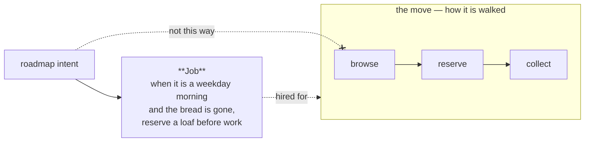

# Mapping — the product as moves and things

**Load when:** explaining how the product works, building or changing a flow, arriving somewhere
whose flows nobody wrote down, or answering "how does anyone get from here to there".

**A project carries two maps, and they answer different questions.** `_ops/ARCHITECTURE.md` says
where the implementation lives — a worker's map of the tree. **`_ops/MAP.md` says how the product
is walked** — the routes through it and the things it is made of. Reasoning about a flow from the
architecture map is how a change lands in the right file and the wrong journey.

---

## What the map holds

**Moves and things, in the product's own words.** A move is a route someone takes — through
screens, through a checkout, through the corridors of a venue, through fire-glaze-pack. A thing is
what the product is made of, and how the things relate. Software gets an entity diagram; a bakery
gets orders, batches and pickup slots. **If a node would sound absurd to someone outside software,
the node is wrong, not the domain.**

## Every move names the job it is hired for

**A move is a route; the job is what somebody was trying to get done when they took it.** A map
of routes alone answers *how this product is walked* and never *why anyone walks it* — and a
roadmap reading that map proposes routes nobody asked for, which is the ordinary way a product
grows features and loses its point.

**Written as a job story, in the move's own section:**

> **Job**: when *&lt;situation&gt;*, someone wants to *&lt;motivation&gt;*, so they can *&lt;outcome&gt;*

**The shape is the argument.** A job story starts with a *situation* — a trigger in the world,
which either happened to a real person or did not — so it can be checked and it can be wrong. *"As
a user I want…"* cannot be wrong: it is a wish wearing a costume, and it survives every review
because there is nothing in it to disagree with. That is why this corpus has no user stories and
does not want any → `audience.md` for how the situation is found rather than guessed.

**One job per move, not per screen.** Jobs multiply the moment they are attached to steps, and a
map with a job on every node is a map nobody reads. If two genuinely different jobs run through
the same route, that is two moves that happen to share screens — say so, and draw them both.

**`unknown` is a legitimate job, and a blank is not.** *"unknown, and here is what would settle
it: …"* is an honest line that names the next act; an empty field is a claim that the question was
never asked. The guard refuses the blank and accepts the named unknown, because the difference is
the whole point (`checking.md`).

The map draws routes. Each route exists because somebody was trying to get something done — and
that sentence, not the route, is what a roadmap should be reading.

**The dotted refusal is the point.** An intent that points at a *step* proposes a change to a
route; an intent that points at the *job* asks whether the route still serves it — and sometimes
the answer is a different route, or none. A map without jobs can only be argued about
step-by-step, which is how a product accumulates screens nobody needed.

**Enforced on what a commit adds**, like every other gate: a move already drawn is left alone.
Retro-filling an existing map is a project's decision, not a commit's → `self-maintenance.md`.

---

**Every node names something that exists** — a screen, a place, a step, a file, an entity. The
same law as the skill's own diagrams, for the same reason: **a box with nothing behind it is a
second source of truth, and the one that ages first.** A node for something being built belongs in
the task building it, not here.

**The map holds current state only.** The future lives in the roadmap, and **the roadmap points at
the map nodes it will change** — the future looks at the map; it is never drawn on it. A map
carrying both is wrong in two directions at once: it describes a product that does not exist yet
and stops describing the one that does.

**And it says where it ends.** *What is not mapped yet* is a section, not a silence — the same
honesty as the architecture map's unmapped ground, and the same consequence: **a claim about an
unmapped area is `unknown`**, not inference from the mapped parts.

**A mockup or a still sits beside its node** under the ordinary embedding rules — a relative-path
image, a design file as a pointer with a still frame (`project-layout.md`). A live preview is a
runtime's capability, not a file's; the still is what survives the clone.

---

## Birth and growth

**The map is seeded, never commissioned.** The first discovery pass already draws a current flow
and a target flow — those graduate here when the work ships. Entering an existing project, the
corridor read produces the coarse shape of the whole — **that shape is the map's first version**,
written down instead of evaporating with the session (`entering.md`). **A mapping project — a
standing task to "map the product" — is the smell**, the same one as a team assembled before the
work: a guess about the work, in cartography form.

**One file, until it outgrows one file.** `_ops/MAP.md` holds the index — the top-level moves, one
line each, and the things. A move that outgrows its section becomes `_ops/map/<move>.md` and the
index keeps one line pointing at it. Small stays small here too.

---

## The ladder — how a flow climbs

| Level | Lives in | Climbs when |
|---|---|---|
| a task's working flow | **the task body** — a draft, owned by the work | it does not, until the work is accepted |
| a feature's flow | the map — a section or its own file | **in the same task that changed the behaviour** |
| the product map | `_ops/MAP.md`, the index | always current, never planned |

**A task that touches a move names its nodes — the ones it changes *and* the ones it will
create.** Extending the product is the ordinary case, not the edge: a feature is usually new
nodes and new edges, and the task declares them the way it declares any deliverable. **They are
born in the task and land on the map in the same task that ships them** — creating is not a
different mechanism from changing, it is the same DoD line: *the map reflects what shipped*.
This is docs-follow-decisions applied, not a new law, and **a review that finds the behaviour
changed and the map untouched sends the work back**. Without the DoD line this map dies the death
of every optional wiki — current for a month, then a liability, because a map known to be stale
is worse than no map: it answers confidently.

**Writing a task against unmapped ground says so in the task.** The same shape as touching an
area with a deferred item: mention it once, and the owner decides with the risk visible. Unknown
ground is not a reason to stop — it is a reason the estimate is wider and the corridor may need
to grow first (`entering.md`).

**The task-level flow does not climb.** It is scaffolding — alternatives considered, dead ends,
states that got cut. The map receives **what shipped**, in its final shape. Promoting the draft
wholesale is how a map becomes an archive of intentions.

---

## What reads it

**Arrival reads it first.** The map is the product half of *base only* — the coarse shape each
task then deepens. A returning owner's *"what is this again"* and a new worker's first hour are
the same read.

**Dispatch leans on it.** A task naming its map nodes hands the worker the context that matters
without the whole tree — the same reason a task is workable from itself.

**And the node answers back who is on it — regenerated by `scripts/map-blocks.py`, never by
hand.** A generated `touched by:` block on the node lists
the tasks currently declaring it, with their statuses — derived from the tasks' own
declarations, one side stored and the other shown (`PATTERNS.md` §5, §6), never written by
hand. **Two live tasks on one node is a finding**: surfaced at decomposition as
related-or-blocking to settle, not discovered at review as a collision.

**Where a knowledge graph exists, the map is a source for it — never the reverse.** The graph is
a derived index; the file is canon. A clone gets the map with the repository, which is the whole
premise (`project = f(repo)`), and any index rebuilds from it.

---

## What holds this

Honesty about enforcement, per the usual scale (`permissions.md`):

- **fence and reachability** — a split-out move file nothing points at, a mermaid fence left open:
  `enforced_by: validator` where the project wires the guard, `prose-only` where it does not.
- **the map edit in the DoD** — `enforced_by: request`: the review is the gate, and the reviewer
  is looking at a diff that changed behaviour without touching `_ops/MAP.md`.
- **node truth** — that every node still names something real is `prose-only`, and it is the audit
  that walks it (`checking.md`): the same sweep that finds a stale architecture map finds a node
  whose referent is gone.
