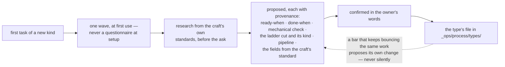

# Pipelines — the stages work travels

**Load when:** setting up how a kind of work moves, changing a ladder, or deciding what must be
true before something advances.

**A pipeline is the stage sequence a task travels.** An **automation** is recurring or triggered
work that starts something. These were briefly the same word, which would have been expensive:
one describes a path, the other fires → `automations.md`.

---

## The file

```yaml
name: design
stages: [brief, explore, draft, review, handoff]
terminal: [handoff]
gates:
  draft->review:
    check: "_ops/scripts/check-screens.py"   # mechanical — a command that must exit clean
  review->handoff:
    review_by: non-author               # a review in History from someone who did not draw them
    fields: [evidence]                  # fields that must be present on the task
default_for: [design-task]
starts: on-completion
```

**The body says what this pipeline is for and when to run it** — the same `why` discipline as
resources and declared fields. *"For visual work without code: landing pages, screens, identity.
Not for research, which has its own."*

**Stages are linear.** No branches, no conditional paths, no parallel lanes. **Parallelism is
children sharing a wave** → `decomposing.md`. A branching pipeline is two pipelines that have not
admitted it yet.

**Gates sit on transitions, not on stages.** *"Cannot enter `done` without a review"* is a
condition on an edge. Two consequences worth having: a validator can check that **at least one
terminal stage exists** and that **protected transitions are intact**; and a **hook may act on a
transition** where a gate only blocks one.

**A gate is data, and three kinds are checkable** — `check` (a command that must exit clean),
`review_by: non-author` (a review line in History from someone who is not the worker), `fields`
(named fields present on the task). **The prose beside a gate explains it to a person and is
never what holds it** — `scripts/transition.py` is the one door a stage change goes through: it
reads this same block, refuses an illegal move with the reason, and appends the transition to
History. A gate written only as prose still reads, and is honestly `prose-only` — the validator
warns rather than blocks on it. **The machine guards; it never advances** — nothing transitions
itself is untouched by any of this, because the door refuses and records, and starting the next
step stays a person's or the dispatcher's act.

**The picture of the ladder is drawn from the same block, never beside it.** Where a pipeline
wants showing — the docs, an owner's *"show me how work moves here"* — the mermaid view is
generated from this yaml, stages as nodes and gates as edge labels, between markers, a view and
never a source (`PATTERNS.md` §6, `diagrams.md`). Hand-drawing a second copy of the ladder is
how the picture and the door drift apart.

**A hook that acts obeys the automation rule: it may create work, never move anyone else's.**
A post-transition hook that opens a task or a request is fine; one that advances something is the
automatic transition that makes boards lie.

---

## Type owns the destination, pipeline owns the road

This split matters, because collapsing it is what makes team-level overrides impossible.

| | Owns |
|---|---|
| **type** (`_ops/process/types/*.md`) | the **definition of done**, the **default pipeline**, the **default cut on the description ladder** (`writing-work.md`), and the **declared fields** |
| **pipeline** (`_ops/pipelines/*.md`) | the **stages** and the **gates** |

A bug and an article genuinely have different definitions of done, so the DoD belongs to the
type. But the design team wanting *everything it touches* to run the design ladder is a statement
about **who is doing the work**, not about what kind of work it is — and that is only expressible
if the ladder lives somewhere the team can override.

**Resolution is the cascade, minus one rung:**

| Level | Sets |
|---|---|
| **project** | the base pipeline, optionally per type |
| **team** | overrides it for its own work |
| **task** | overrides both, explicitly |

**There is no role rung** — a pipeline belongs to the work, not to the worker. That is a
declaration of rungs, not an exception (`PATTERNS.md` §1). When the pick is not obvious, say which
one was taken and why, in one line.

---

## The ladders that ship

Ready on day one for **feature · bug · content · chore · migration · tooling**, and **editable
from day one, with the diff shown**. A project that only ever does design keeps exactly one.

**A type is born at first use, in the project's own words.** The stock six are seeds for projects
where those names do not sound absurd; where they would — a podcast has no migrations, a workshop
has no bugs — the first question is **what the kinds of work are called here**, and what comes
back may be two types, not six. **One wave per type, when a task first needs it** — never a
questionnaire at setup, the same law as no roster before a task needs a craft.

**Research comes before the ask, so the defaults offered are real.** For an unfamiliar craft the
recommended bars arrive **sourced from the craft's own standards**: empty options hand the
research to the owner, and researched silence guesses their taste — the wave does neither. The
answers — the bars, **the type's cut on the description ladder** (`writing-work.md`), and **the
type's fields** — the `x.*` attributes the craft's own standard names
(`templates/TYPE-template.md`) — land
in `_ops/process/types/<type>.md` (`templates/TYPE-template.md`) with their provenance,
and hold **until the owner asks — or the bar itself accumulates the evidence and proposes its own
change** (`checking.md`), never silently: the bar is a locked surface.



**The fields are the part everyone forgets to propose**: declared at birth they are board
columns from day one; discovered per task, twelve spellings of one attribute → `templates/TYPE-template.md`.

The default shape is `build → review → accept`, with a design stage in front where design
precedes build, and **parallel gates inside review**.

**Removing a stage asks what happens to the tasks currently in it, first.** That question is the
whole safety of editing a live ladder.

---

## Six categories carry the meaning

The system understands six **status categories**; each pipeline names its own stages inside them
→ `writing-work.md`. That is what lets one board show work from different pipelines without
either pretending they are the same or splitting into separate boards.

---

## What starts the next unit of work

One field, three values, replacing what used to be two settings and an object:

| `starts` | Means |
|---|---|
| `manual` | the owner starts each one. **The default** |
| `on-completion` | finishing one pulls the next — a continuous conveyor |
| `schedule:<cron>` | a clock starts it |

Keeping these as one axis prevents the state nobody documented before: a mode and a schedule both
switched on, with no answer for what happens.

**Two honest conditions on the non-manual values.**

**"Continuous" means "when something is running."** There is no server: the next unit starts when
a session opens, when a background session picks it up, or when a scheduled run fires. What does
not exist is work proceeding while the machine is off, and **a schedule that silently did not run
is worse than one that says it was late**.

**A continuous conveyor must declare its stop conditions.** A pipeline that pulls its own next
item with nothing to stop it is an unbounded loop, and unbounded loops are the thing the whole
gate apparatus exists to prevent.

---

## Recurring work is a pipeline plus an automation, not a new thing

A content operation — a weekly publishing conveyor, a support rotation — is not a project and not
an entity. It is a **pipeline** (the stages), an **automation** (what fires), a **team** and its
**resources**. Nothing else is needed.

Worth saying plainly because the owner experiences it as one thing and will look for one switch:
**there isn't one, and the setup is a flow rather than an object.** Splitting a project in two
because it has both features and content is almost always wrong — that is one project with two
types and two ladders. Split only when the second stream genuinely has its own team and its own
cadence.
