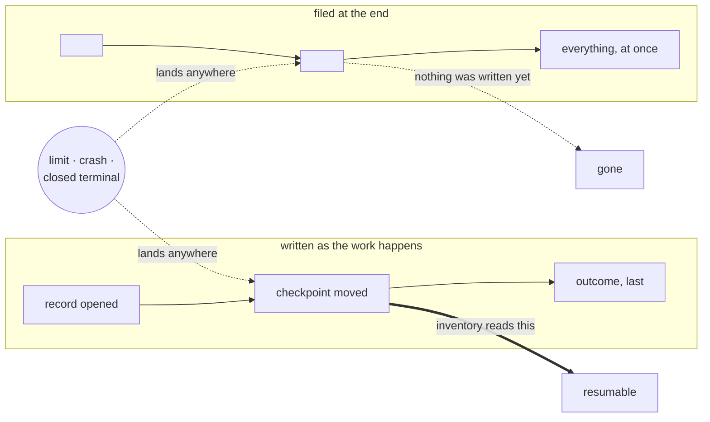
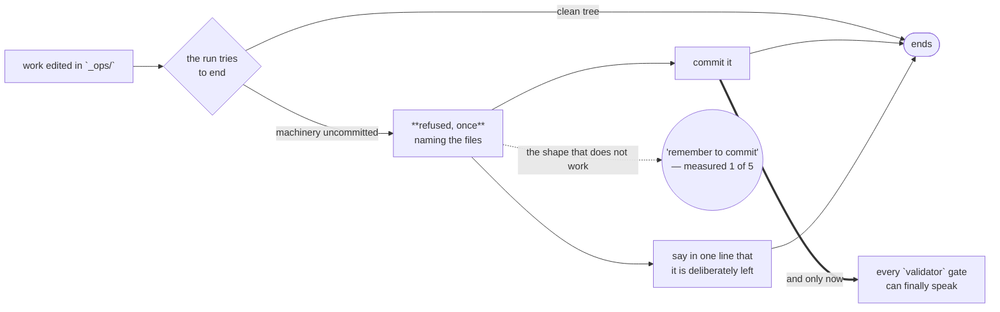

# Recovering — when a run died

**Load when:** work stopped without finishing, a limit was hit, or a board went backwards
overnight.

**A dead run is a rerun, not a rewrite.** Resurrect it with a **state inventory**; never restart it
from scratch.

---

## The state inventory

Three questions, answered **from the repository** rather than from the dead run's context:

| | Read from |
|---|---|
| **committed** | git — what actually landed |
| **applied** | the plan or checklist in the task, against what is in the working tree |
| **remains** | the difference |

**Applied work is never redone.** It holds for the same reason the whole design holds: **the state
lives in artifacts** — the commits, the worktree, the numbered plan — **not in the context of a
session that no longer exists**. A fresh worker rebuilds its position from the repo and continues.

Which is also why **incremental commits are not tidiness but the recovery mechanism**. A run that
committed nothing leaves nothing to resume from, and its work is genuinely gone.

### Write as you go, never at the end

**The record is written while the work happens, not filed when it finishes** — and a run does not
choose when it ends. A limit, a crash and a closed terminal all arrive without warning, and each
one falls on whatever was still only in the session's head. **Everything above depends on this
one habit**: the inventory reads `applied` from the tree, the attempt count reads the record,
`Commits · checkpoint` names where to resume — all three read files that a run intending to
write "at the end" never wrote.

**So the ordering is a rule, not a preference:** the record opens when the work opens (→
`entering.md`), the checkpoint moves when the work moves, and the outcome is the *last* field
filled rather than the first. A run that ends `interrupted` should still leave a record that
says what it did — that is the difference between an interruption and a disappearance.

**The kill arrives at the same moment in both rows.** The difference is not diligence, it is
ordering: one row has already put its position on disk, the other still holds it in a session
that no longer exists.

### And the ending is refused while the machinery sits uncommitted

**Measured 2026-08-22**: across ten runs of one scenario the player edited `_ops/` eight times and
committed **zero** times — so every gate this project holds, all of them `enforced_by: validator`
and therefore enforced *at the commit*, went unreached. The gates were not weak. The work never
arrived at them.

**So the reach is held by a hook at the moment the work would be abandoned**, and it **forbids**
rather than asks. That distinction is the whole design and it is measured too: this system's own
rounds found a fact delivered at session start bought 0 of 5, a demand at the ending bought 1 of
5, and the one rule that only ever *forbids* held 5 of 5 in all three. A reminder to commit is the
shape that does not work.

**The doubled edge is the whole reason this exists.** Every gate this project holds fires at the
commit; until one happens they are unreachable, and a run that edits and stops has passed through
all of them without meeting any. Measured 2026-08-22: 0 commits in 10 runs before this gate, 5 of
5 answering it after.

**It asks whether THIS session wrote anything.** A run that only answered a question is not
blamed for the tree it inherited — that version refused a pure *"what's next?"* over work that
predates it and told the reader to commit changes they did not make, which teaches them the
message is noise.

**It speaks once, and it watches the ground the other gates guard** — `_ops/` and the package
manifests, because a manifest is not the craft's business but a standing commitment another gate
reads. Once, because a gate that repeats is one the next run learns
to sit through, and because leaving work deliberately is a real answer — said in a line. It watches `_ops/` and the manifests, because those are what the other gates key on; the
product's own source stays out, since a run may rightly leave that for review. `OPSINIST_UNCOMMITTED_GATE=off` is
the deliberate door.

**This is prose, and prose measures poorly** — it is the ordering habit the two forms beside it
exist to survive. What actually enforces it is the dispatcher writing the run record rather than
the worker (→ `cost.md`), and the guard warning when a task closes with no run record naming it
(→ `checking.md`). Neither can make a live run write sooner; they make its silence visible after.

---

## Interrupted is a state, and it must be visible

**A run that never returned is marked `interrupted` at the next session start, and the task
visibly regresses** rather than sitting done-ish.

**A board that went backwards overnight is reporting a failure, not somebody's edit.** That is the
correct reading, and it only works if the regression is allowed to happen — a system that quietly
holds the last known good state is a system that lies exactly when it matters.

`interrupted` is its own outcome, distinct from `failed` (it tried and could not) and `canceled`
(someone decided). **An intentional cancel always carries a reason**; one without a reason is
accidental and is revivable.

---

## Limits

A limit is not a failure of the work. It is the window closing.

**Nothing brings it back on its own**, and **retrying before the reset fails again** — so the reset
time is worth reading rather than guessing at.

**The reset is a known future moment**, which makes it a one-shot schedule rather than something to
poll. A limit hit at 02:10 that resets at 07:00 should not wait for a human to come back and
notice → `automations.md`.

**Levers, when limits keep firing rather than happening once:**

- **Model and effort tiering** — the top tier on the part that needs it, not on everything
- **Fewer concurrent workers** — past three to five, coordination costs more than it returns
- **An API key instead of a subscription** — pay per token, no session window; and note that the
  ledger then becomes the bill rather than an attribution → `cost.md`
- **Smaller units of work** — a task that fits one run cannot be half-killed by a window

---

## Fresh or resumed — pick deliberately

Two different recoveries, and the difference is not cosmetic:

**Resuming** reuses the working directory and continues the session. **Cheaper**, and right when
the state is sound.

**Starting fresh** rebuilds from the repository. **Safer after corrupt state** — a confused run
that wrote nonsense into its own context will keep being confused if you resume it.

**A manual rerun resets the attempt counter and has no ceiling; automatic retry does not.** So
rerunning by hand three times is three attempts the automatic bound never sees. Say which one is
happening.

**Three attempts on one task stop it** → `escalating.md`. The count is per task rather than per
"the same error", because deciding two errors are the same is a judgement an agent makes about its
own failure.

---

## Rolling back a change that made things worse

**Name what regressed — behaviour, not vibes** — and when it started. *"It feels worse"* is not
something a rollback can target.

**Find the restore point.** Git is the restore point: the commit before the change. There is no
separate backup, and none is needed for anything the repository holds.

**Restore, then verify the regression is actually gone.** A rollback that nobody checked is a
second change of unknown effect.

**Log what broke, next to the change.** The next attempt starts informed rather than repeating it.

**Rollback is normal**, not an admission. A version that has to be un-shipped and a version that
was never allowed to ship both end in the same place; only one of them taught you something.

---

## Recovering the conversation, not just the work

**A session that ended without a wrap-up is itself an interrupted run.** Leaving a conversation
with a role should write its tail to that role's thread and distil it if it crossed the threshold;
leaving a project deserves the same and usually does not get it.

**And where the runtime can resume a session, the dead transcript is a readable source — once.**
The wrap-up that was owed can be taken retroactively: reopen the last session, ask for the three
writes, close it clean. This is salvage, not a lifestyle — the transcript stays a source and
never becomes the record — and **in a runtime that keeps no transcripts the door does not exist**,
which is resolved and said per runtime rather than assumed (`runtimes.md`). What it buys is
narrow and real: the only thing a silent ending ever risks is what lived in talk alone, and this
recovers exactly that.

**On returning, three questions, and they must not be blended:** what needs me · what happened ·
**what changed that we did not change** → `requests.md`, `drift.md`.
