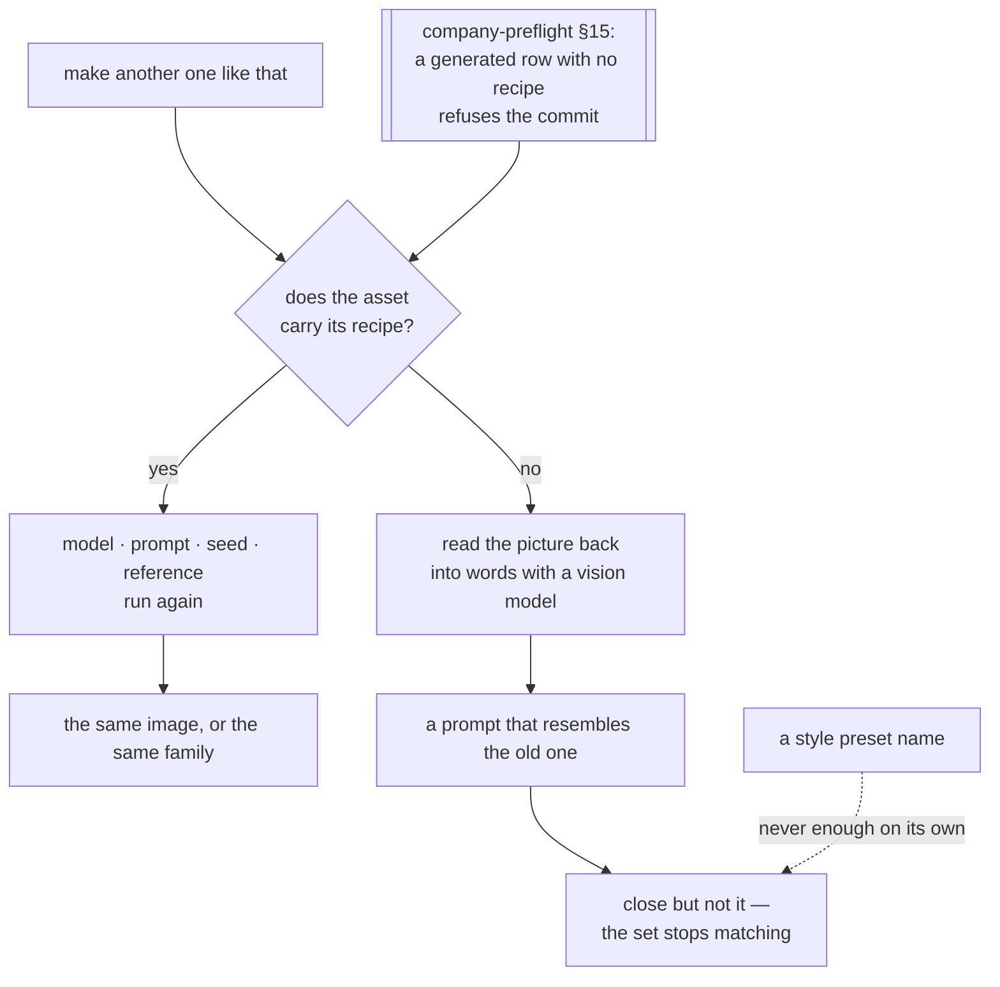

# Visual work — structure before pixels, and a system that follows solutions

**Load when:** designing anything seen — screens, a landing page, an identity, packaging,
thumbnails, a deck.

**The failure this exists to stop:** asked to design an app, a worker went straight to high
fidelity and produced gradient placeholders — **because it skipped the structure and skipped the
real tools**.

---

## Structure first

**Run process discovery before drawing anything** → `process-discovery.md`. For an interface it
typically surfaces: information architecture → user flows → low-fidelity wireframes → **the owner
approves the structure** → high fidelity → design system. **Discovered per project, not
hardcoded**, and the owner cuts or adds steps.

**Low fidelity comes first on purpose.** Approving structure on cheap artifacts saves the tokens
and the days that redrawing finished screens costs — and it is **where the owner's taste enters
while changing it is still cheap**.

**Tool each step by its function, and write `gap` where there is none.** A flow library for
journeys, a wireframing approach for low fidelity, a component library for high fidelity. *The
flows step going silent because the skill list only covered high fidelity is exactly the miss the
gap column catches.*

**Ask the design intake up front — never guess it.** Before a pixel: **style and mood · colour
direction · references the owner likes · anti-references, which are hard nos**. A worker that asks
only *"what stack?"* and starts drawing has skipped the questions that decide whether the output is
theirs or generic.

**Compose, don't hand-draw.** Screens are assembled from a component library, not written as
one-off markup. Hand-written screens are **both slower and worse**: a library makes a screen a
composition rather than a generation.

**The gate rejects; it does not rubber-stamp.** A review that passes bad design is not a review. It
checks the work against **the approved structure, the intake, and the design system** — a mismatch
fails it. **The advisor never signs off design itself; the owner does**, at the checkpoint their
control level set. **"It rendered" is not "it's good."**

---

## The design system follows solutions

Any project that ships a repeatable form accumulates one: **tokens** (colour, type, spacing,
motion — or a palette and a cover grid), **components or templates** (interface parts, thumbnail
layouts, packaging, letter formats), and **a catalogue**.

**It is not designed up front. It accumulates from what shipped**, and the curator is the design
lead or the sole designer.

**Reuse-first, at specification time.** Discussing *any* solution, answer explicitly: **covered by
the existing system, or does this need an extension?** Default is reuse; an extension is a
**deliberate, argued decision recorded in the spec** — what is added and why the existing pieces do
not fit. **The system grows by argument, never as a side effect.**

**Three origins — build · adopt · inherit.**

**Building your own** is the default here.

**Adopting a ready-made system** — a platform's guidelines, a franchise brand book, a publisher's
style guide: **the host's guidelines become law**, and the conventions file records **host +
version + our delta layer**. Extensions live in a **separate, documented layer that follows the
host's own philosophy and naming** — **never restyle or reinterpret host semantics, which is
exactly how teams drift away from the host they adopted**. When the host ships a new version, treat
it like an upgrade: **preview the diff and its impact on the delta layer before applying**.

**Inheriting an existing own system** — typical when joining: audit and prepare exactly like a
takeover. Inventory tokens, components and templates; **a verdict per piece — complete, needs
additions, needs rework**; wire the conventions; only then extend.

**Systematize in the same unit of work.** A shipped solution that introduced new patterns gets a
systematization child in **that** piece of work: new tokens documented, one-offs promoted to
components or **marked as deliberate exceptions**, stale pieces pruned.

**Systematization is ordinary work with a review.** Built by whichever craft owns the medium —
code tokens by an engineer, cover templates by a designer, a voice guide by a copywriter — and then
**reviewed by the curator** before it merges into the system. Same pattern in every domain:
whoever systematizes, the curator reviews.

**One component standard, fixed when the system is switched on.** The curator seeds the
conventions: naming, **one props convention** borrowed from the chosen stack's idioms, state names,
and **a single documentation shape per component** — anatomy · properties · variants · states ·
tokens used · do and don't. **Every component, whoever made it, is documented to that shape.**
Mixed conventions — one component in one style, another improvised — are exactly what this kills.

**Consult real-world component catalogues before inventing component names and APIs.** Someone has
already had this naming argument.

**Design QA checks against the system**: implementations use tokens and components, not hardcoded
values; **a deviation is either fixed or argued into the system**.

**An annotated overlay carries its labels on the image itself.** A screenshot with marked
zones — a predicted-attention map, a QA markup — states each zone's kind on the pixels:
`counted` (a contrast ratio, a tap-target) · `predicted` (a model's guess, and which class of
model) · `panel` (personas, direction-only), with the provenance line in a corner. **An image
separated from its prose is a lossy copy of the claim** — forwarded alone, a prediction travels
as a fact — and the label on the pixels is the only rung that survives the forward. A
*continuous* heatmap is a model run, which makes it a tool: it enters through the import gate
like any tool, never silently inside a consultation (`catalogue.md` — visual hierarchy &
predicted attention).

**Assets obey the same conformance.** One icon set, one illustration style, one photographic look,
widening only on a real gap — **mixing reads as amateurish exactly the way hardcoded values do** —
and **every shipped asset is recorded with its licence**.

---

## Brand — systematized, not a folder of moodboards

**Home is the project's brand documentation**, and it does not stay there: **its formal elements
flow into the design system** (palette and type become tokens, formats become templates) and **its
verbal rules flow into the guide**, so every worker writes in the brand voice by default. **Brand
dissolves into two places rather than sitting in one.**

**What is load-bearing in the book:** positioning (for whom · what · against what · why believe) ·
**an archetype — a shorthand workers can act on**, not decoration · personality sliders with
recorded positions · **tone of voice: three to five words plus a sample paragraph per register —
executable examples, not adjectives** · values, short · **references and anti-references, where
anti means hard bans** · tagline and naming rules.

**Workshop artifacts are discovery input, not the book.** Competitor teardowns, *"what we dislike
about the old one"*, metaphor boards — they feed it and are **distilled into it**; they are not it.

**New brand** → discovery → book → **owner approval, because identity is outward** → systematize.

**Existing brand** → **audit first, never rebuild**. Inventory logo, palette, type, voice,
positioning; **a verdict per piece — complete, needs additions, needs rework**; fill only the gaps
the owner confirms. **An existing brand is incumbent convention, and it is respected.**

**Rebrand** gets its own discovery pass, with two devices worth having: **a change-magnitude score
from one to ten** — evolution versus revolution, **and it scopes everything downstream** — and an
explicit **keep/change list**. Then three to five candidate directions, and **the owner picks**.

**A creator or a small brand gets the same structure scaled down**: positioning, voice, a visual
kit, and **material templates** — story, post, cover formats — living in the design system like any
other component.

---

## A generated asset carries its recipe

**A generated image whose recipe was not written down is unrepeatable, and that is how a style
dies quietly.** Nobody notices on the day. A month later somebody needs the second banner in the
set, the model has moved, the prompt is gone, and what comes back is *close but not it* — so the
set stops matching, and no single decision was ever made to let it.

**So a generated row in `_ops/assets.md` says `origin: generated` and carries four things
beside the licence.** The `origin:` is what makes the row findable — `origin: drawn` · `stock` ·
`generated` — and it is the field the commit gate selects on, because a list of model vendors
goes stale between releases while a field does not. **A row that predates this and merely says
*generated* in its source is still caught**, so nothing silently stops being checked:

| | |
|---|---|
| `model` | the exact model or endpoint, version included — `flux-1.1-pro`, not "the fal one" |
| `prompt` | **verbatim, the whole string.** Not a description of it |
| `seed` | the number, or **`seed: none`** where the model exposes none — an honest answer, and the only other one accepted |
| `reference` | the path or url of a style/reference image, where one was used — **this, not a preset name, is what actually makes two images match** (`catalogue.md` → *Style presets*) |

**This is a field, not an instruction to be careful**, and it is enforced where the project can
see it: `templates/company-preflight.sh` refuses a commit whose asset register declares a row
`origin: generated` — or, for a row written before that field existed, merely says *generated* —
and carries no recipe. **The two doors are the same two as everywhere**: write the recipe, or
write `seed: none` — one edit, needing no new information.

**Why a field and not a sentence:** the cheap answer is impossible to write. *"Generated with AI"*
satisfies nothing, and a prompt cannot be reconstructed from memory without visibly being generic
— the same property that made *what did the page say* work where *what did you check* was answered
with three fabricated dates (`self-maintenance.md`).

**Recovery, when a recipe is already lost, is the expensive repair** — a vision model reads the
image back into words (`catalogue.md` → *Image → prompt*), and what comes out is a new prompt that
resembles the old one, never the old one. **It is a salvage route, not a substitute for the
field.**

**The preset is a vocabulary, the recipe is the mechanism, and salvage is the expensive repair.**
This diagram lives here rather than in the gallery because `diagrams.md` is at its line budget —
and a diagram beside the rule it draws is not a worse home for it.
