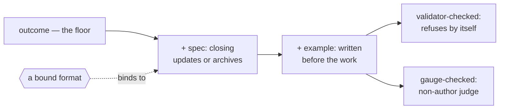

# Writing work

**Load when:** writing a task, editing one, filing something that arrived from outside, or
deciding what "done" will mean.

**An id resolves to a path, and to nothing else.** `T-18` is `_ops/tasks/T-18.md` — open the file.
**There is no task service to ask**, and where the runtime happens to ship one, it belongs to that
session and not to this project → `runtimes.md`. **Measured `2026-07-31`:** told a routine was
recorded in `T-18` and `T-21`, two runs in five called the harness's own `TaskGet` with those ids,
received an empty session list, and answered that they could not find them — a false *"it does not
exist"* about two files sitting in the tree. **This rule is `prose-only` and is on that list**: it
asks rather than blocks, and rules that ask were measured twice this day not to fire.

A **task** is a unit of work: it has an id, an assignee, a thread, runs and a cost. A checklist
line has none of those. That test decides what becomes a task and what stays a line in a
description — and it is the same test at every depth, because **subtasks are tasks**.

---

## The file

One task, one file, in a **flat directory**: `_ops/tasks/T-8F3KQ2-billing-page.md`. The hierarchy is
a field, not a folder, so **re-parenting is a one-line edit** rather than a file move that
breaks every link.

| Field | Value | Why it exists |
|---|---|---|
| `id` | `T-` + six from **32 symbols: the digits and every letter but `I`/`L`/`O`/`U`** (the four that misread as 1, 1, 0 and V) | **immutable, never reused** — links point here, so renaming is safe. **Minted by `scripts/new-id.py`, never invented**: it draws on the system's random source and skips what the tree already uses, and `scripts/check-structure.py` refuses a duplicate. **A model asked for a random id is not a random source** — two unrelated projects once produced the same five |
| `title` | text | the human handle. Duplicates are refused at creation |

**The shape is a file, not a description of one → `templates/TASK-template.md`.** This table says what each field *means*; the template is what you copy, and a field skipped in a copied file leaves a hole somebody sees.
| `type` | a file in `_ops/process/types/` — feature · bug · content · chore · migration · tooling | selects the **definition of done** and the default pipeline. A bug and an article do not run the same gates. Not a closed list: types are editable from day one |
| `stage` | a named step of this task's pipeline | **the only state field.** The pipeline declares which *category* each stage belongs to |
| `stream` | `product` (default) · `system` | `system` is work on the project's own machinery, and it carries full history regardless of size → `self-maintenance.md` |
| `assignee` | a role, a human, or a group | **a group means "not yet decided who"** — legitimate on a parent, a finding on a leaf |
| `parent` · `wave` | id + integer | decomposition and the barrier → `decomposing.md`. **The parent's wave plan may declare a per-wave `on_child_failure`** — the policy lives on the parent, beside the plan |
| `priority` | `none` (default) · `low` · `medium` · `high` · `urgent` | opt-in, see below |
| `start` · `due` | dates | **a start date gates the whole task, preparation included** |
| `release` · `milestone` | ids | grouping → `grouping.md` |
| `labels` | list | filtering; the taxonomy lives in `_ops/process/labels.md`. **Never label the stage** — it is a field |
| `area` | declared `select` | which part of a monorepo this touches |
| `created` · `updated` | dates | audit and staleness |
| `created_by` | human · agent | provenance: who put this in the world. **Who *changed* it is git's job**, read from the commit trailer — a declared field for that would rot the first time someone forgot it |
| `source` | `linear:ENG-88` + `version_seen` | only when checked out from an external tracker |
| relations | see below | |
| `waiting_on` | free text | a wait that is not a task |
| `exclusive` | bool | needs the live checkout instead of a worktree → `dispatching.md` |
| `x.*` | anything | custom fields, see below |

**The body** carries the outcome, the acceptance criteria, the thread, and the generated blocks.

---

## What "done" will mean — write it before anything is staged

**The outcome in one sentence:** what must be true of the thing delivered. **If it cannot be
written, the task is not ready to start**, and that is the cheapest possible moment to discover
it.

**Then what does not count.** Enumerated near-misses stop work being declared done sideways:
a plan instead of a result · a quietly narrowed scope · one example treated as verification ·
"it builds". **These are worth more than another criterion for what does count**, because the
ways work is falsely declared finished are fewer and more predictable than the ways it can
succeed.

**Then the acceptance criteria** — objective where the craft allows it.

**Every fact in the task carries its source and check-date, or is written as "verify X."** The
executor should trust or re-check each claim, **never inherit a recalled number as settled**.
**And the source is cited to its place, not to its cover**: `file.md#Section (sha:ab12cd34,
checked YYYY-MM-DD)` — the anchor says where, the short content-hash says *what was there when
it was read*, so a passage that moves under its citation turns the fact `unknown` rather than
quietly wrong (§11, §17). The link-check walks anchors and hashes where it is wired
(`scripts/check-links.py`); elsewhere the format still reads, and is honestly `prose-only`.

**The assignment must stand on its own.** Workable from the task and its linked documents
**without the thread** — *"as discussed above"* is not a spec, and it stops being readable the
moment a run dies with its context. The harness enforces this for you: a spawned worker does
not inherit the conversation that spawned it.

**Where the description lives is a ladder, not a menu** (`PATTERNS.md` §1, §25) — **the axis is
unchanged: where the authoritative description of the work lives.** What changed is the shape of
the choice, and the reason is a defect the old menu built in: it made `spec` and `example`
exclusive, and real work refuses that — **a spec document *and* a failing test is the ordinary
pairing, not a corner case.** A ladder holds the pairing; a menu forced a bucket. The setting
keeps its name — `spec_mode` — and its values; what a value names now is **the cut**.

| Rung | Adds | Closing the task |
|---|---|---|
| `outcome` — **the floor, always present** | the result and its definition of done, in the task | closes the task, nothing else |
| `spec` | a document the task points at, outliving it | **updates that document** — or archives it, where the bound format archives |
| `example` | **a checkable artefact written before the work** — a failing test, a golden sample, a reference output | the artefact passes or the exemplar is matched; **that is the proof** |

**The cut names the highest surface; the rungs below are presumed.** A task cut at `example`
normally carries the document too. Where it honestly does not, **the absent rung is declared,
never implied** — a bakery with a reference batch and no brief is a legitimate shape *said out
loud*. One value to state, resolve and change (§25), and the ordering carries the reasoning:
**the longer the result must outlive its authors and the more hands will work it, the higher
the cut.**

**The `example` rung has two kinds, and the honesty scale already names them.** A
**validator-checked** exemplar — a failing test, a schema, a replayable acceptance set —
refuses by itself: `enforced_by: validator`, and this is the kind that cannot rot silently,
because **a document drifts and says nothing; this drifts and fails.** A **gauge-checked**
exemplar — a reference batch, a model issue, a gauge part — needs **a judge who is not the
author** holding the comparison: `enforced_by: request`. The gauge is still worth more than a
document alone, because comparing against a concrete thing disciplines the review — but **a
ladder that promises a content project the rigour of a test suite is lying to it**, so the kind
is stated with the cut.

**And `example` is not the definition of done wearing a new name.** A definition of done says
*what counts as finished*; the rung says *where the description lives*. The artefact is written
**first** and the task points at it — at the floor with tests in the DoD, the description is
still prose in the task and the tests check it afterwards.

**`custom` is not a rung — it is a binding.** A project with its own format — change folders, a
one-pager per feature in Notion, an RFC directory, a recipe card — binds that format to the
`spec` rung and climbs no differently. **A binding answers three things**: where these live,
how a task references one, and what closing does to it — updates it or archives it, whichever
that format does. The third used to say "updates them" and was wrong for the option this file
recommends most: a change-as-a-folder is *archived* when done. **Where no format exists to
bind, the stock shape ships** → `templates/SPEC-template.md` — the fields good specs share,
whatever the craft calls the cover.

**Depth resolves by the cascade, and the type holds the default** — project (**optionally per
type**, the same declaration pipelines make) → team → task, most specific wins, recorded on the
run (§1). **The type's depth is born at the type's own wave** (`pipelines.md`), proposed from
the craft's standards with provenance and confirmed in the owner's words: a bug arrives wanting
`example` because its *ready when* already demands a reproduction; a newsletter issue arrives
wanting the model issue; a chore arrives wanting the floor. **A mixed project needs no ceremony
for this** — the recipe, the screen and the exporter each read their depth from their type, and
the board stays one board.

**The honest trade-off is unchanged:** cutting at the floor leaves weaker durable
documentation. Fine for most projects, wrong for a system that outlives its authors.

**The interview asks where to cut, and only when the answer changes something** — a deliverable
that is code or a long-lived system; for a one-off job, a piece of writing or a design pass,
the floor stands and the question is not asked (`starting.md`). It is asked rather than
inherited **because it decides what a task looks like**: most cascading settings change what
work *costs* — this one changes what work *is*. **A project that answers this on day ninety
rewrites every task it has written.** Asked in outcome terms, with its consequence, never as a
menu of names.

**When the owner binds a format, name real options rather than asking them to invent one.**
Two are stocked **for software projects**, both MIT, both driving many agents by slash command
→ `catalogue.md`: **OpenSpec** — a change is a folder of plain markdown, archived when done,
which is this system's own premise already — and **Spec Kit**, phase-gated and heavier, for a
project that wants those gates. **Elsewhere the format already has a craft name** — a creative
brief, an editorial policy, a recipe card, a PRD — and **a project that already has its own
format keeps it**; the three binding questions are what make any of them work, and they do not
change with the tool.

**And look before offering — the recommendation comes from their tasks, not from a menu.** A
tree that already holds specs (`specs/`, `docs/rfcs/`, an `openspec/` folder) has answered this
in its own files. **And where it has not, the existing tasks answer it anyway**: read a handful
and see how work is already described. Tasks that are a line and a definition of done are a
project working at the floor, and telling it to adopt a spec format is proposing a rewrite it
did not ask for. Tasks already carrying context, constraints and acceptance detail are a project
**already writing specs inside its tasks** — and the honest offer is to give that a home rather
than to keep it cramped in a title field. **Say which you saw and quote one**, so the
recommendation is evidence rather than taste, and **the owner's existing choice outranks a better
default.**

**Their own words are a legitimate answer, and shaping them is the job.** The rungs are names
for a question that does not have to be answered in names: an owner who says *"we keep a
one-pager per feature in Notion and the task links to it"* has given a complete and correct
answer, and turning that into a working configuration is the advisor's work, not theirs. **Take
the description, read it back in their words, and land the cut and the three binding things**
— where these live, how a task references one, what closing updates — **as a proposal to
confirm, not as a form to fill.** A free answer beats the buckets (`PATTERNS.md` §26), and
*"none of those, we do it like this"* is the answer most likely to be right, because it comes
from a practice that already exists.

**Choosing one is an import, not a preference.** Anything arriving from outside goes through the
import gate and lands in the tooling register with what it is, why, and its check-date
(`tooling.md`, `resources.md`) — **a tool agreed in conversation and installed by nobody is the
commonest way a cut becomes a lie**, because the tasks start referencing a format the
repository has no machinery for. **The setting and the tool land together, or neither does.**

---

## Status: six categories, your own stage names

The system understands six **categories**; each pipeline names its own stages inside them. One
board across different pipelines, and one state field instead of two that disagree.

| Category | Meaning | Stage names a project might use |
|---|---|---|
| `backlog` | not committed | Backlog · Idea · Icebox |
| `planned` | committed, not started | Planned · Todo · Ready |
| `started` | in flight | In Dev · Draft · Fact-check · Review |
| `completed` | done | Done · Shipped · Published |
| `canceled` | dead | Canceled · Won't do |
| `triage` | **arrived, not yet decided** | Triage · Inbox |

**`blocked` is not a status.** A blocked task is `started` with a blocker: the field is the
reason, the status is the state. **Adding `blocked_by` to something in progress is a finding,
not a silent status change.**

**A task says what it touches, on both maps.** The product side — the map nodes it changes or
creates (`mapping.md`) — and the implementation side: the areas and paths the work will move
through, derived before they are declared (`entering.md` — maps, then the tree's own evidence,
then the owner for the remainder). **Impact nobody derived is a guess wearing a field**, and where
the touched ground is unmapped, the task says that instead (`mapping.md`).

**Ready is a bar too, and it has a name: the definition of ready.** A task may start when it is
workable from itself and its linked docs, its outcome can be written, and its type's own *ready
when* holds — a reproduction for a bug, the agreed colour for a commission (`pipelines.md` for
where that bar lives). The gate sits on the transition into `started` and is **held by whoever
picks the task up**: not ready comes back as a question, never as a guess.

**A dependency that carries an artifact says so, and the artifact is part of ready.** `blocked_by`
orders work; a task that **consumes** another's deliverable — the research a draft is written
from, the schema an exporter targets — names that input, and its *ready when* includes the input
existing at its named place. Orders-only where orders-only is true: pretending every dependency
carries a payload is as wrong as pretending none does.

**A task may carry a `check` — the mechanical half of its bar, run before review is asked for.**
A command that must exit clean: the tests, a schema validation, the acceptance set replayed,
`enforced_by: validator` on the honesty scale. **Failure returns to the worker with the output**,
not to the reviewer — a human reading a diff that a script would have bounced is the most
expensive linter there is. The retry is bounded by the law that already exists: **three attempts
at the same failure is a signal**, and exhaustion escalates rather than quietly proceeding. The
split between what a check settles and what a review judges is `requests.md`'s table — a `check`
never substitutes for the review, it clears the ground so the review is about judgement.

**A task names what must exist afterwards, and where each thing lands.** The outcome says when it
is done; the deliverables say **what the world contains once it is** — files at paths the manifest
allows, a node on `_ops/MAP.md`, a doc updated, evidence in the thread. **Done is checked against
that list, never against the feeling of doneness**: each named thing exists at its named place,
the evidence is embedded where the discussion happened (`writing-for-humans.md`), the review came
back from a non-author, and only then does acceptance move the status. **A task that names no
deliverables can be declared done by anyone, about anything** — which is the polite form of never.

**Whoever did the work does not move it to `completed`.** Meeting the definition of done earns
the *review*, not the status: `completed` is the **accept** step of the ladder, and it belongs to
whoever owns acceptance — never to the author, for the same reason a review does not. A run that
finishes says so, hands over the evidence, and **leaves the task `started`**. This is a different
rule from *nothing transitions itself* (`SKILL.md`), which forbids a transition happening as a
side effect; this one names who may perform the deliberate act. **Measured:** two runs met the
same definition of done and read the corpus opposite ways — one closed the task, one left it open
for the owner — because only the first rule was written down.

**Triage is a category, not a stage**, so raw intake never pollutes planning. Everything
arriving from outside lands there — feedback, an audit finding, an imported ticket, a proposal.
**Four dispositions, and the advisor proposes while the owner decides:**

- **accept** — into a pipeline stage
- **decline** — `canceled` **with a reason**, because a decline nobody can explain returns next
  quarter
- **duplicate** — the `duplicate_of` relation, closing it against the original. **Not a stage
  name**: a stage called "Duplicate" loses the pointer to what it duplicates, which is the only
  reason to mark it
- **snooze** — hidden until a date **or until new activity**

---

## Relations — five names, one side stored (`PATTERNS.md` §5)

| Stored on me | Shown on them | Meaning |
|---|---|---|
| `blocked_by: [T-8F3KQ2]` | `blocking` | waits for another task |
| `duplicate_of: T-2M9XK4` | `duplicated_by` | the same thing, already filed |
| `related: [T-7NCVB1]` | `related` | connected, no direction |

**Only one side is stored.** "I am blocked by X" is a property of me, so it lives in my file and
X shows it in a generated block. **Storing both sides guarantees drift** the first time someone
edits one and forgets the other.

**Flat syntax** — `blocked_by: [T-8F3KQ2]` — so it reads by eye and greps cleanly.

**`parent` and `blocked_by` are different relations and are routinely confused.** `parent` is
*part of*; `blocked_by` is *waits for*. A task can be a child of one feature and blocked by a
task from another.

**Unblocking does not start the work.** When the blocker closes, the task **surfaces** as ready
and waits for a person or the dispatcher.

## `waiting_on` — for waits that are not tasks

A person doing a physical thing, hardware, a delivery, a client's answer, an access grant. It
points at no task, which is exactly why it needs its own field: without it such waits get
miscoded as dependencies or vanish into a comment.

**A wait ages like a request** (`PATTERNS.md` §8). Past N days it surfaces, because **a wait
nobody chased and a wait everybody forgot look identical from outside**.

A task assigned to the owner behaves the same way: it has no runs and no capacity, so its
progress is invisible until they say otherwise. It ages.

---

## Priority — opt-in, and four rules or it rots

`none` is the default. **You mark what stands out instead of numbering everything**; the moment
priority is mandatory, everything becomes "medium" and the field means nothing.

**Dates beat priority.** A date is a constraint, a priority is a preference. Where a due date
exists, the argument is over. And **never start dated work early** — the start date gates the
whole task, **preparation included**: work that genuinely must run sooner is split into its own
*undated* task at intake, as a recorded decision, never reinterpreted away as "that part is
only prep". Publishing early is as wrong as late.

**Priority is not the order.** The real order between items is one hand-kept list. Two sources
of order drift within a week, and then nobody knows which is true. → `grouping.md`

**Anti-inflation is checked, not banned.** When the share of `urgent` crosses a threshold, ask:
real crisis, or drifted labelling? Forbidding "too much urgent" is useless — sometimes it is
genuinely on fire. Not noticing that everything became urgent is the failure.

**Children inherit, and an agent never raises the priority of its own task.** Same class as
never editing the bar you are measured against.

---

## Saying how, not only what

**A result that does not say how it was reached cannot be checked, repeated, or priced.** So a
report carries the route beside the outcome: **which tool was driven, which skill was used, what
was read, and what was verified rather than assumed**. Not a transcript — the shape of the work.

**This is not politeness, it is the evidence rung made concrete.** *"The export is fixed"* and
*"the export is fixed; reproduced it with the failing row, changed the escaping, and re-ran
against the same input"* are different claims, and only the second can be disagreed with.

**Work that was subcontracted says so, and says on what.** An answer produced by spawning three
helpers is not one agent's answer, and a record that hides that cannot be priced or repeated:
**each subprocess is named with its tier and what it was for** — *"two greps on the light tier, one
reading pass on medium"*. **The parent's model is not the answer's model** when most of the work
happened underneath it.

**Every recorded act carries what produced it** (`PATTERNS.md` §27)**.** A run line already does; so does a thread entry,
a review verdict, a decision and a persona's reaction — **role, model, effort and strategy, on
the thing itself**. It costs one field and it answers the question that otherwise has no answer a month
later: *was this written by the top tier or by the cheap one, and was that the right call?* In a
project where different tasks run on different models, and some on different runtimes, an
unattributed line is a claim from nobody.

**The run record already holds the machine half** — tool uses, skills declared against skills
used, the resolved settings → `dispatching.md`. What belongs in the report is the part a person
reads: **the one tool that mattered and why it was reached for**, especially when it was paid,
external, or the second thing tried after the first failed.

---

## History — one append-only table per task

The field holds the current value; the history holds how it got there. Without it "how long has
this been in review" and "how many times was this reassigned" require reading git diffs, which
is archaeology rather than reading.

| Kind | Recorded |
|---|---|
| `run` | one dispatch → `dispatching.md` |
| `transition` | from → to, when, by whom |
| `assignment` | who now, who before |
| `relation` | added or removed |

Append-only: **a correction is a new line, never an edit to an old one.** This is what makes
age-in-stage, bottleneck detection and the "what happened since I was last here" summary
possible at all — each is a read over this table rather than a stored counter that drifts.

---

## Custom fields — `x.` namespace

**Undeclared fields pass through** — carried, shown, searchable, never rejected. Nobody should
have to ask permission to write a note to themselves.

**Declared fields get powers**: board columns, filters, audit rules. Seven types — text ·
number · select · multi-select · date · checkbox · url. A `url` field **automatically joins the
link-check set**.

**Every declared field carries "what this means and when to set it."** A field whose meaning is
unwritten is filled inconsistently within a month, and then it is worse than no field.

---

## What a small job does not get

An id, a stage ladder, a run record, a role, a docs skeleton. Written down rather than left to
judgement, because the temptation is always to add "just one small thing". → `quick.md`
